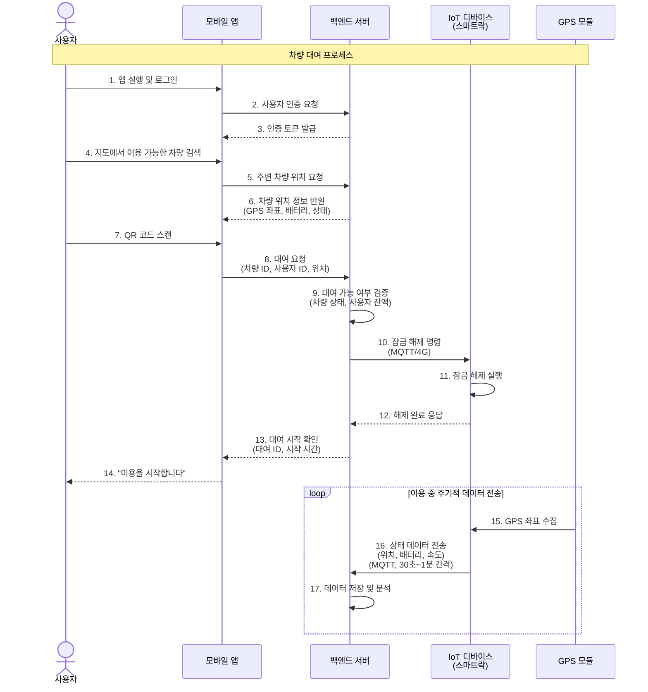
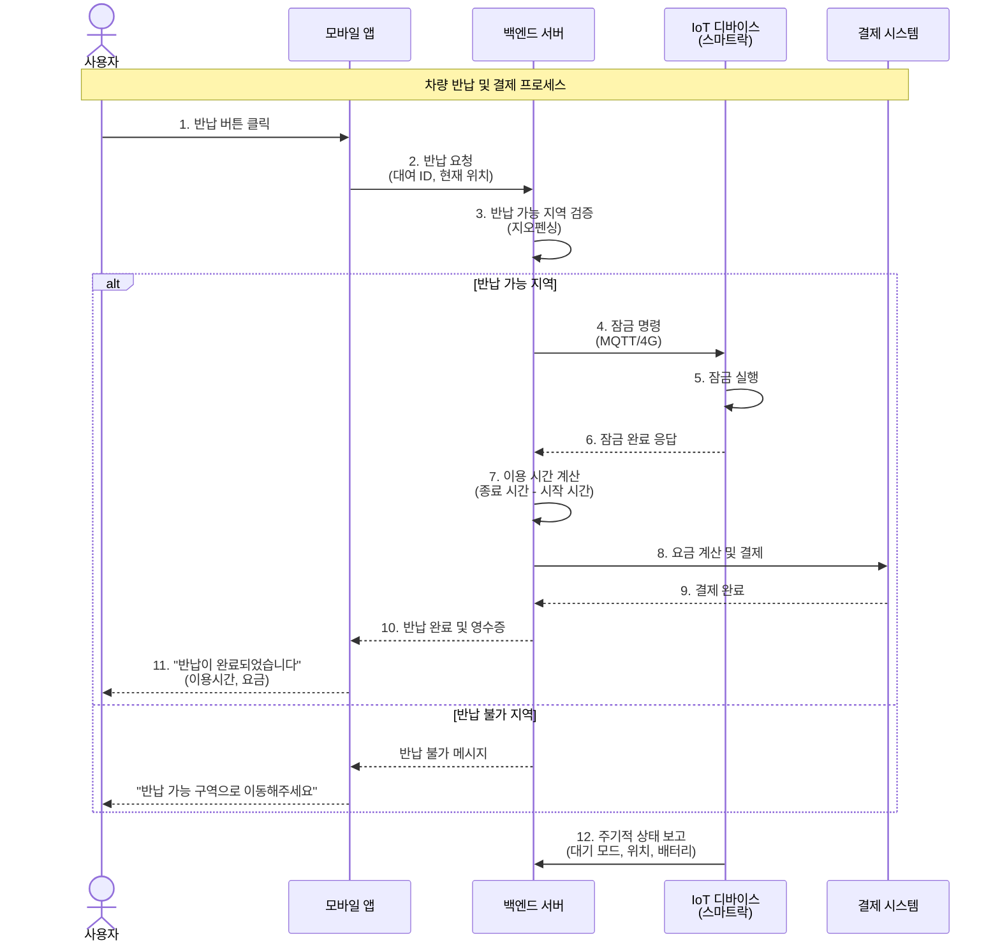
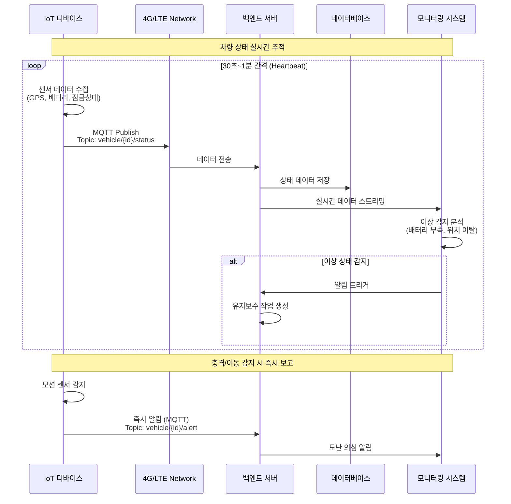
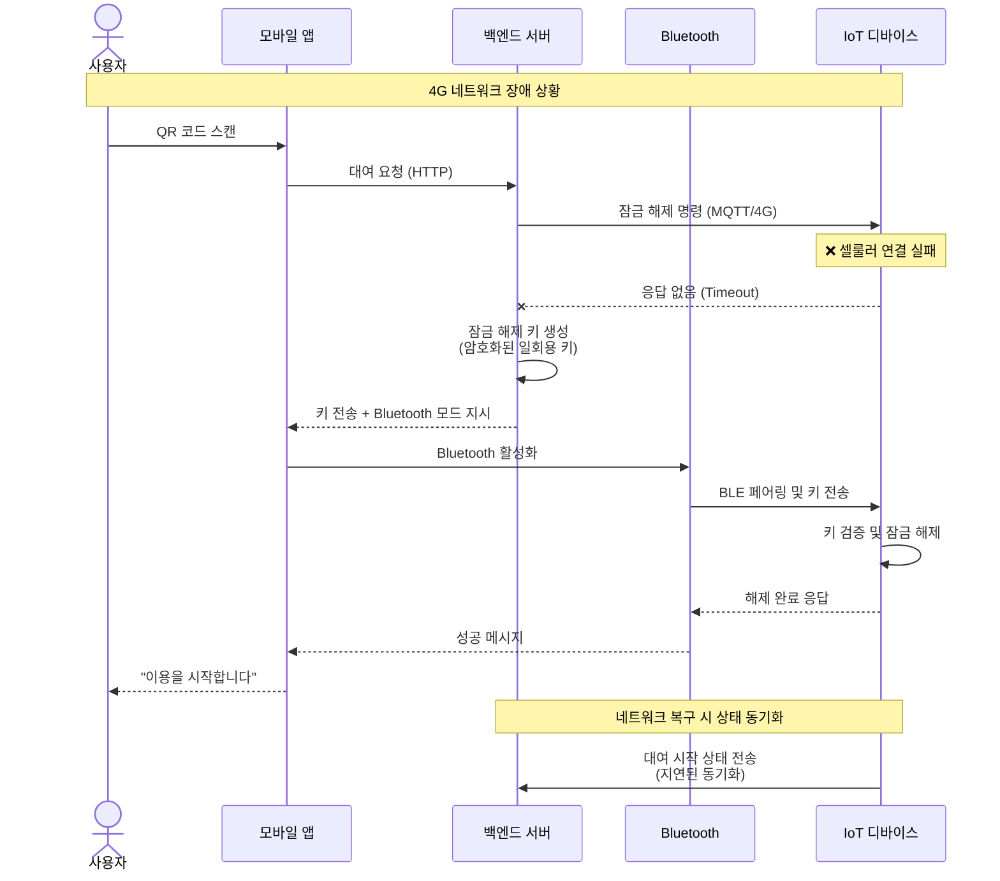
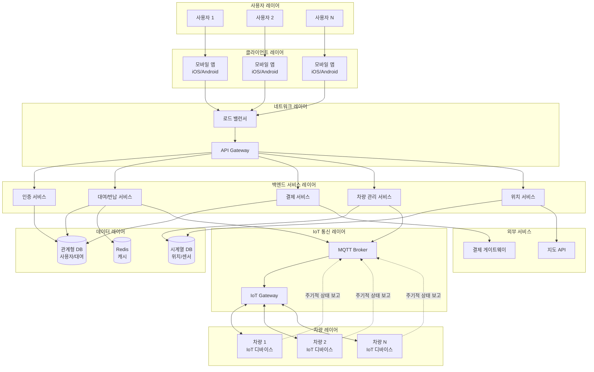
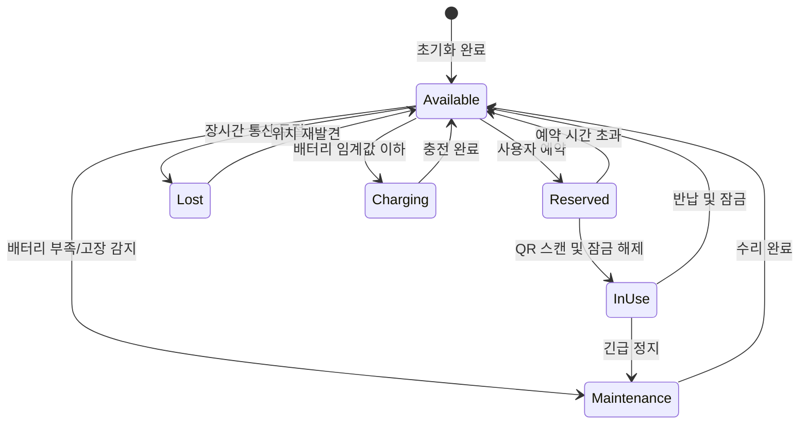

# 공유 모빌리티 시스템 AS-IS 아키텍처 분석

## 📋 개요

본 문서는 서울시 따릉이, Swing, Lime 등 실제 운영 중인 공유 모빌리티 서비스의 아키텍처를 분석하여, 사용자 앱-서버-공유차량 간의 통신 구조를 정리합니다.

---

## 🚲 주요 서비스별 기술 스택

### 1. 서울시 따릉이 (공공 자전거)

**기술 특징:**
- **통신 기술**: LG U+ LTE-M1 (저전력 LTE 통신)
  - 약 3만대의 따릉이에 적용
  - 저전력으로 수년간 작동 가능
  - 이동 중, 건물 내부, 지하에서도 데이터 전송 가능
- **잠금 방식**: QR 기반 스마트 락
- **추적 시스템**: GPS 실시간 위치 추적
- **데이터 전송**: 잠금 상태, 배터리 레벨, GPS/Bluetooth 상태를 주기적으로 전송
- **서버 인프라**: KT Cloud 기반 백엔드
- **API**: 공공 데이터 포털을 통한 실시간 대여정보 제공

**아키텍처 특징:**
- 웹 기반 앱 (크로스 플랫폼 지원)
- 도난 방지를 위한 실시간 위치 추적
- 유지보수 편의를 위한 다양한 상태 정보 전송

### 2. Swing (공유 킥보드/자전거)

**기술 특징:**
- **운영 규모**: 전국 약 10만대 (2024년 기준)
- **잠금 방식**: QR 코드 스캔 → 원격 전원 ON
- **차량 종류**: 전동 킥보드, 전기자전거, 전기스쿠터

### 3. Lime (공유 킥보드)

**기술 특징:**
- **운영 주체**: Neutron Holdings, Inc. (캘리포니아 본사)
- **잠금 방식**: QR 코드 스캔 기반
- **운영 모델**: Lime Juicer (프리랜서 충전 파트너)를 통한 수거/충전/재배치

---

## 🏗️ 일반적인 공유 모빌리티 시스템 아키텍처

### 핵심 구성 요소

#### 1. **모바일 애플리케이션** (사용자 인터페이스)
- QR 코드 스캔 기능
- 실시간 차량 위치 지도 표시
- 사용자 인증 및 결제
- 대여/반납 인터페이스
- 이용 내역 및 요금 확인

#### 2. **백엔드 서버** (중앙 제어 시스템)
- 사용자 인증/인가 관리
- 차량 상태 실시간 모니터링
- 대여/반납 비즈니스 로직
- 요금 계산 및 결제 처리
- GPS 데이터 수집 및 저장
- 차량 재배치 최적화 알고리즘
- 유지보수 스케줄링

#### 3. **IoT 디바이스** (차량 탑재 장치)
- **GPS 모듈**: 실시간 위치 추적
- **스마트 락**: 원격 잠금/해제 제어
- **통신 모듈**: 2G/3G/4G/LTE-M 셀룰러, Bluetooth
- **센서**: 배터리 레벨, 모션 감지, 충격 감지
- **전원 관리**: 저전력 운영 모드

---

## 📡 통신 프로토콜 및 방식

### 주 통신 경로: 셀룰러 네트워크

**프로토콜:**
- **MQTT** (Message Queuing Telemetry Transport)
  - 경량 프로토콜로 대역폭 절약
  - 저전력 디바이스에 최적화
  - Publish/Subscribe 모델
  - IoT 표준 프로토콜

- **HTTP/HTTPS**
  - RESTful API 통신
  - 도킹 스테이션 ↔ 서버 통신
  - 앱 ↔ 서버 통신

**네트워크:**
- 4G/LTE 셀룰러 네트워크 (주)
- LTE-M1 (저전력, 장시간 배터리)

### 보조 통신 경로: Bluetooth

**역할:**
- 네트워크 연결 실패 시 폴백
- 서버 → 앱: 잠금 해제 키 전송
- 앱 → IoT 디바이스: Bluetooth를 통한 키 전달

---

## 🔄 시스템 통신 흐름

### 시나리오 1: 차량 대여 (Rental Flow)

### 시나리오 2: 차량 반납 (Return Flow)

### 시나리오 3: 실시간 모니터링 (Real-time Monitoring)

### 시나리오 4: 네트워크 장애 시 Bluetooth 폴백

---

## 🏛️ 시스템 아키텍처 다이어그램

### 전체 시스템 구성도

---

## 📊 데이터 흐름 및 상태 관리

### 차량 상태 전이도

### IoT 디바이스에서 전송하는 데이터

**주기적 전송 (30초~1분 간격):**
- GPS 좌표 (위도, 경도, 고도)
- 배터리 레벨 (%)
- 잠금 상태 (LOCKED/UNLOCKED)
- 신호 강도 (RSSI)
- 펌웨어 버전
- 디바이스 ID

**이벤트 기반 전송 (즉시):**
- 잠금/해제 이벤트
- 충격 감지 (도난/사고)
- 모션 감지 (이동 시작/정지)
- 배터리 임계값 알림
- 오류/장애 발생

---

## 🔐 보안 및 인증

### 1. 사용자 인증
- JWT (JSON Web Token) 기반 인증
- OAuth 2.0 소셜 로그인
- 결제 정보 암호화 저장

### 2. IoT 디바이스 인증
- 디바이스별 고유 인증서
- MQTT over TLS (암호화 통신)
- 일회용 잠금 해제 키 (Time-based)

### 3. 통신 보안
- HTTPS (앱 ↔ 서버)
- MQTT over TLS (IoT ↔ 서버)
- 데이터 암호화 (AES-256)

---

## 🎯 AS-IS 아키텍처의 특징

### ✅ 장점

1. **실시간 추적**: GPS와 셀룰러 네트워크를 통한 실시간 위치 파악
2. **원격 제어**: 서버에서 차량 잠금/해제 원격 제어 가능
3. **데이터 수집**: IoT 센서를 통한 다양한 운영 데이터 수집
4. **사용자 편의성**: QR 코드 스캔만으로 간편한 대여/반납
5. **폴백 메커니즘**: Bluetooth를 통한 네트워크 장애 대응

### ❌ 한계 및 문제점

1. **모놀리식 구조**
   - 모든 기능이 하나의 서버에 결합
   - 부분적 확장 불가능
   - 한 기능의 장애가 전체 시스템에 영향

2. **확장성 제한**
   - 차량 수 증가 시 서버 부하 급증
   - 데이터베이스 병목 현상
   - 지역 확장 시 응답 지연

3. **장애 전파**
   - 결제 시스템 장애 시 전체 대여 불가
   - 단일 장애점 (Single Point of Failure)

4. **IoT 디바이스 통합 복잡성**
   - 다양한 제조사의 디바이스 통합 어려움
   - 펌웨어 업데이트 일괄 관리 복잡
   - 프로토콜 통일 부재

5. **실시간 처리 한계**
   - 수천 대의 차량 동시 데이터 처리 부담
   - 피크 시간대 응답 지연
   - 이벤트 처리 순서 보장 어려움

---

## 🚀 TO-BE 아키텍처 방향

본 프로젝트는 AS-IS의 문제점을 다음 아키텍처 패턴으로 해결합니다:

1. **Microservices Architecture**
   - 인증, 대여, 결제, 차량 관리 등 독립적인 서비스 분리
   - 서비스별 독립 확장 가능
   - 장애 격리 (Fault Isolation)

2. **Event-Driven Architecture**
   - 이벤트 기반 비동기 통신
   - 서비스 간 느슨한 결합 (Loose Coupling)
   - 실시간 데이터 스트리밍 처리

3. **Hexagonal Architecture**
   - 비즈니스 로직과 외부 시스템 분리
   - IoT 프로토콜 추상화 (MQTT, CoAP, HTTP 등)
   - 높은 테스트 가능성 및 유지보수성

---

## 📚 참고 자료 (Sources)

### 따릉이 관련
1. [LG유플러스 통신기술과 만난 '뉴따릉이'...QR코드로 반납·대여 한번에](https://www.newspim.com/news/view/20200715000163)
2. [유플러스 공유자전거 '따릉이' 3만여 대에 'LTE-M1' 통신기술 제공](https://www.lguplus.com/biz/insight/trend/68)
3. [QR형 뉴따릉이, 시민기자가 꼽은 이런 점이 좋다!](https://opengov.seoul.go.kr/mediahub/20103876)
4. [서울시 공공자전거 실시간 대여정보](https://data.seoul.go.kr/dataList/OA-15493/A/1/datasetView.do)

### 공유 킥보드 (Swing, Lime)
5. [Lime(공유킥보드) - 나무위키](https://namu.wiki/w/Lime(공유킥보드))
6. [스윙(공유모빌리티) - 나무위키](https://namu.wiki/w/스윙(공유모빌리티))

### IoT 아키텍처 및 기술
7. [Hardware overview for shared micro-mobility: IoT & GPS devices, connectivity](https://www.atommobility.com/blog/hardware-overview-for-shared-micro-mobility-23-iot-and-gps-devices-connectivity-1)
8. [IoT Solutions for Shared Mobility Operators — Comodule](https://www.comodule.com/shared-mobility)
9. [QR System with GPS Tracker IoT Device for E-bikes Sharing Project](https://www.omnismartiot.com/Rental-Electric-Bike/qr-system-with-gps-tracker-iot-device-for-e-bikes-sharing-project.html)

### Bike Sharing 시스템 아키텍처
10. [What is the Communication Principle of Shared Bikes?](https://www.omnismartiot.com/News/What-is-the-Communication-Principle-of-Shared-Bikes.html)
11. [Bicycle-sharing system - Wikipedia](https://en.wikipedia.org/wiki/Bicycle-sharing_system)
12. [Smart Mobility Solutions through Bike Sharing System](https://emiratesscholar.com/system/publish/221223101218642.pdf)
13. [Wireless sensor network based management system for electric bicycle-sharing](https://www.academia.edu/108052073/Wireless_sensor_network_based_management_system_for_electric_bicycle_sharing)

---

## 📝 분석 요약

본 AS-IS 분석을 통해 다음을 확인했습니다:

1. **통신 구조**: 앱 ↔ 서버 ↔ IoT 디바이스의 3계층 구조
2. **주요 프로토콜**: MQTT (IoT), HTTP/HTTPS (앱), 4G/LTE 네트워크
3. **핵심 기능**: QR 기반 대여/반납, GPS 실시간 추적, 원격 잠금 제어
4. **주요 문제**: 모놀리식 구조, 확장성 한계, 장애 전파, IoT 통합 복잡성

이러한 분석을 바탕으로 TO-BE 아키텍처에서는 마이크로서비스, 이벤트 기반, 헥사고날 아키텍처를 적용하여 문제를 해결합니다.
