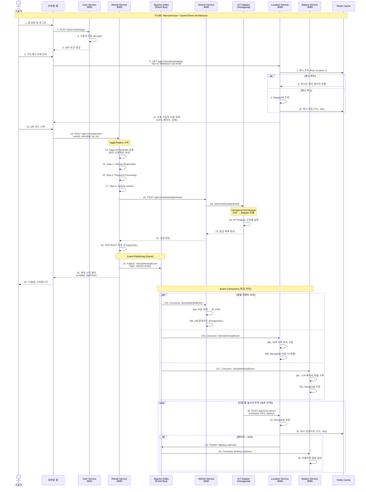
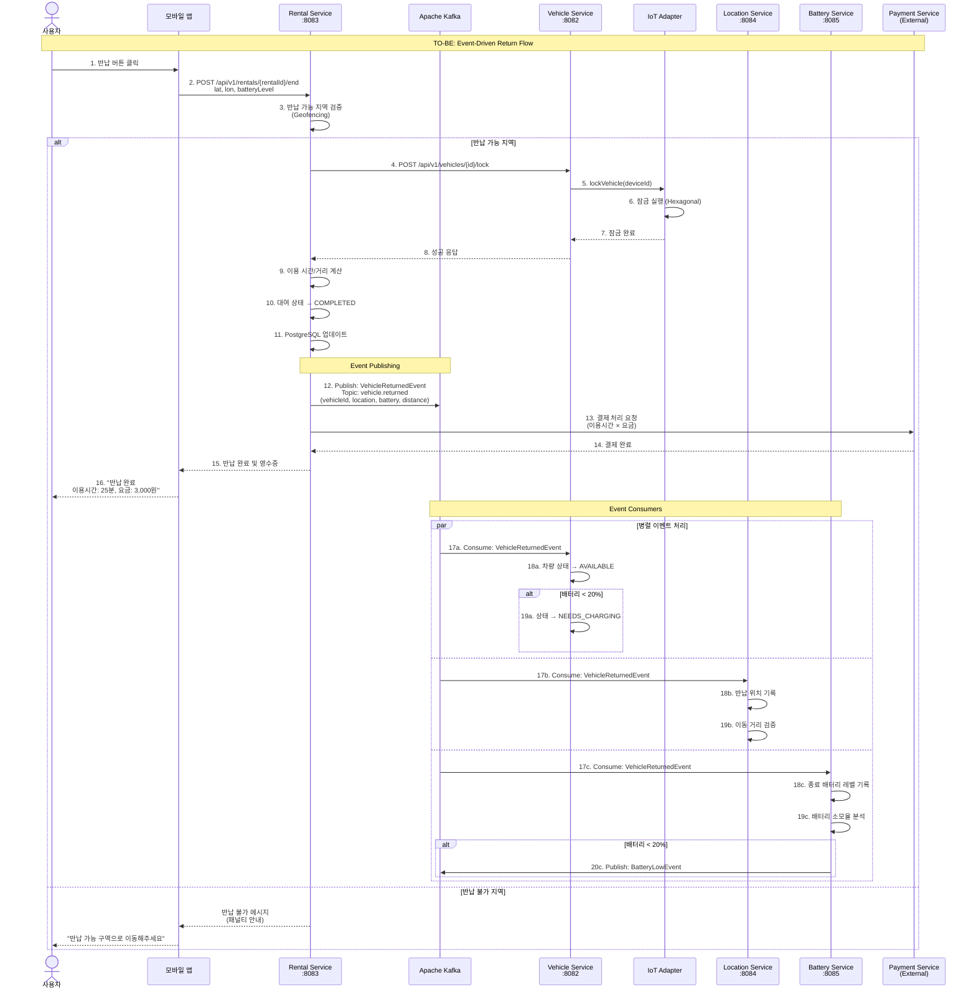
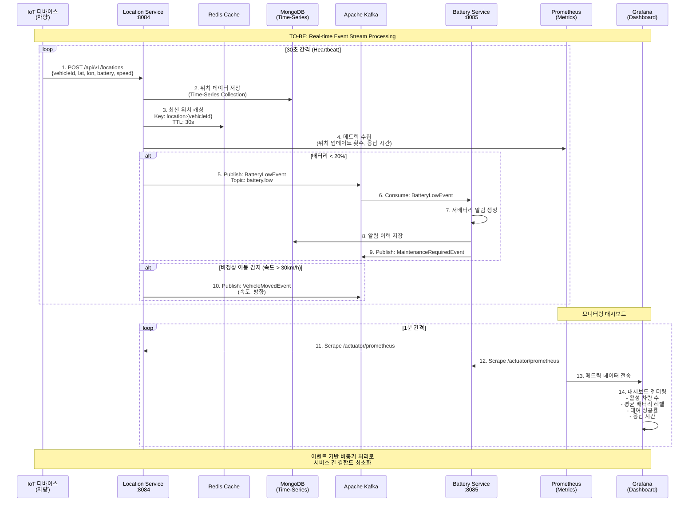
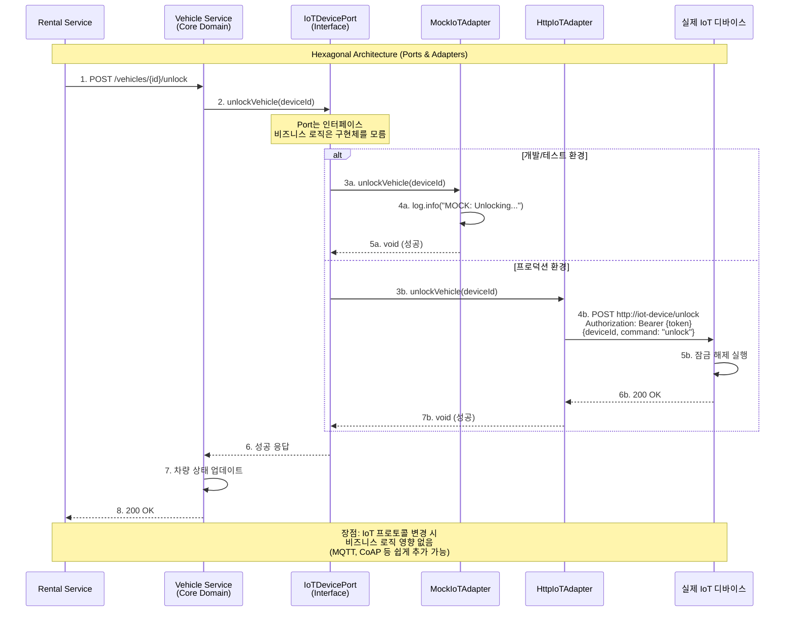
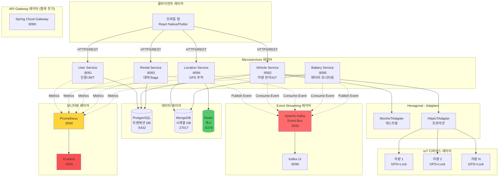
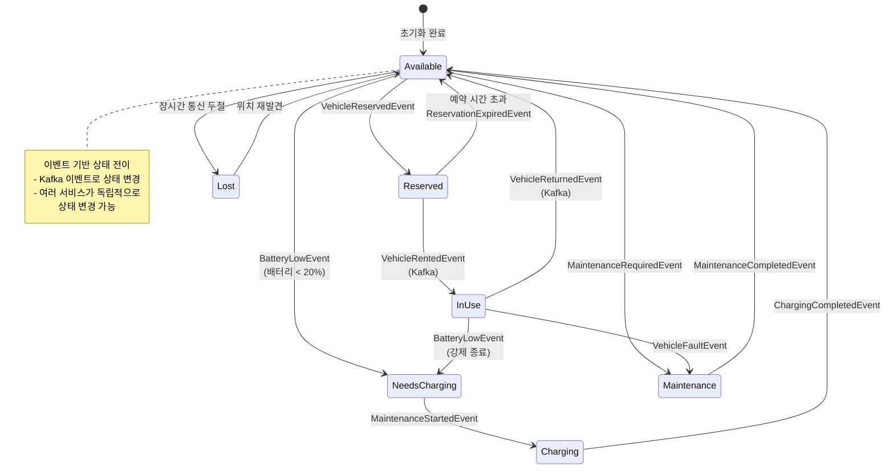
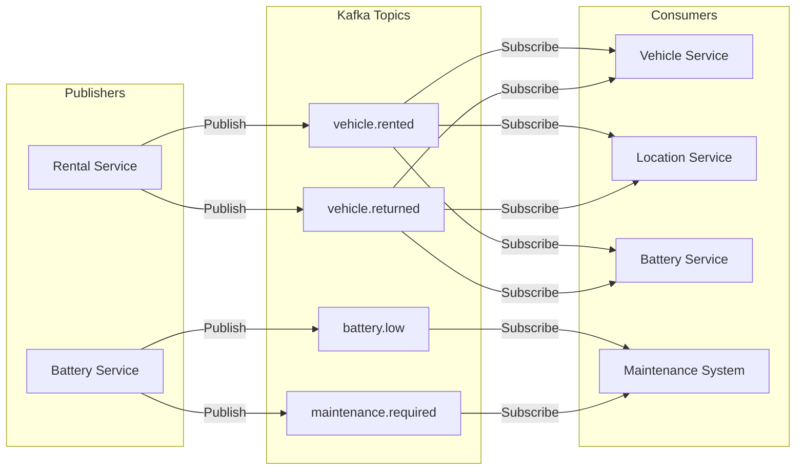

# 공유 모빌리티 시스템 TO-BE 아키텍처

## 📋 개요

본 문서는 **Microservices, Event-Driven, Hexagonal Architecture**를 적용한 TO-BE 시스템의 아키텍처를 AS-IS와 동일한 형식으로 정리하여 비교 분석을 용이하게 합니다.

---

## 🏗️ TO-BE 시스템 구성

### 1. Microservices 아키텍처

기존 모놀리식 구조를 **5개의 독립적인 마이크로서비스**로 분리:

| 서비스 | 포트 | 데이터베이스 | 책임 (Responsibility) |
|--------|------|--------------|----------------------|
| **User Service** | 8081 | PostgreSQL | 사용자 인증/인가, JWT 토큰 관리 |
| **Vehicle Service** | 8082 | PostgreSQL | 차량 CRUD, IoT 제어 (Hexagonal) |
| **Rental Service** | 8083 | PostgreSQL | 대여/반납 트랜잭션, Saga 오케스트레이션 |
| **Location Service** | 8084 | MongoDB | GPS 추적, 지오스페이셜 쿼리, Redis 캐싱 |
| **Battery Service** | 8085 | MongoDB | 배터리 모니터링, 저배터리 알림 |

### 2. Event-Driven Architecture

**Apache Kafka**를 통한 이벤트 기반 비동기 통신:

**주요 이벤트 토픽:**
- `vehicle.rented` - 차량 대여 이벤트
- `vehicle.returned` - 차량 반납 이벤트
- `battery.low` - 저배터리 알림 이벤트
- `location.updated` - 위치 업데이트 이벤트
- `maintenance.required` - 유지보수 필요 이벤트

### 3. Hexagonal Architecture (Ports & Adapters)

**Vehicle Service**에 적용된 헥사고날 아키텍처:

```
비즈니스 로직 (Core Domain)
        ↕
    Port (Interface)
        ↕
   Adapter (Implementation)
    ↙          ↘
MockAdapter  HttpAdapter
```

**Port (IoTDevicePort Interface):**
```java
interface IoTDevicePort {
    int getBatteryLevel(String deviceId);
    Location getLocation(String deviceId);
    void lockVehicle(String deviceId);
    void unlockVehicle(String deviceId);
}
```

**Adapters:**
- `MockIoTAdapter` - 테스트/개발용 Mock 구현
- `HttpIoTAdapter` - 실제 IoT 디바이스 HTTP 통신

### 4. 인프라스트럭처

- **PostgreSQL**: 트랜잭션 데이터 (사용자, 차량, 대여 기록)
- **MongoDB**: 시계열 데이터 (GPS 위치, 배터리 로그)
- **Apache Kafka**: 이벤트 스트리밍 플랫폼
- **Redis**: 위치 데이터 캐싱 (30초 TTL, 10배 성능 향상)
- **Prometheus + Grafana**: 메트릭 수집 및 시각화

---

## 🔄 시스템 통신 흐름

### 시나리오 1: 차량 대여 (Rental Flow with Microservices + Events)



### 시나리오 2: 차량 반납 (Return Flow with Event-Driven)



### 시나리오 3: 실시간 모니터링 (Real-time Monitoring with Event Stream)



### 시나리오 4: Hexagonal Architecture - IoT 디바이스 추상화



---

## 🏛️ 전체 시스템 아키텍처

### TO-BE 시스템 구성도 (Microservices + Event-Driven)



---

## 📊 차량 상태 관리

### TO-BE 차량 상태 전이도 (Event-Driven State Machine)



---

## 🔄 Event Flow 상세

### Kafka 토픽 및 이벤트 구조



### 이벤트 구조 예시

**VehicleRentedEvent:**
```json
{
  "eventId": "evt-12345",
  "eventType": "VehicleRented",
  "aggregateId": "vehicle-001",
  "timestamp": "2025-11-23T10:30:00Z",
  "version": "1.0",
  "data": {
    "vehicleId": "vehicle-001",
    "userId": "user-123",
    "rentalId": "rental-456",
    "startLatitude": 37.5665,
    "startLongitude": 126.9780,
    "batteryLevel": 85
  }
}
```

**VehicleReturnedEvent:**
```json
{
  "eventId": "evt-67890",
  "eventType": "VehicleReturned",
  "aggregateId": "vehicle-001",
  "timestamp": "2025-11-23T11:00:00Z",
  "version": "1.0",
  "data": {
    "vehicleId": "vehicle-001",
    "userId": "user-123",
    "rentalId": "rental-456",
    "endLatitude": 37.5700,
    "endLongitude": 126.9800,
    "batteryLevel": 65,
    "distanceKm": 3.5,
    "durationMinutes": 30
  }
}
```

---

## 🎯 TO-BE 아키텍처의 특징

### ✅ 주요 개선사항

#### 1. **Microservices Architecture**
- **독립적 배포**: 각 서비스 독립적으로 배포/확장 가능
- **기술 스택 자유도**: 서비스별 최적 기술 선택 가능
- **팀 자율성**: 서비스별 팀 구성 및 독립 개발
- **장애 격리**: 한 서비스 장애가 전체 시스템에 영향 없음

**예시:**
```
AS-IS: 결제 모듈 장애 → 전체 시스템 다운
TO-BE: Payment Service 장애 → 대여는 계속 가능, 결제만 지연
```

#### 2. **Event-Driven Architecture**
- **느슨한 결합**: 서비스 간 직접 호출 없이 이벤트로 통신
- **비동기 처리**: 대여 요청 즉시 응답, 후속 처리는 백그라운드
- **확장성**: Kafka 파티셔닝으로 수평 확장
- **이벤트 소싱**: 모든 상태 변경 이력 보존

**성능 비교:**
```
AS-IS: 대여 요청 → 5개 DB 트랜잭션 직렬 처리 → 3~5초
TO-BE: 대여 요청 → Rental DB 저장 + 이벤트 발행 → 0.5초
      나머지 처리는 비동기 (사용자 대기 불필요)
```

#### 3. **Hexagonal Architecture**
- **비즈니스 로직 보호**: IoT 프로토콜 변경 시 Core 영향 없음
- **테스트 용이성**: Mock Adapter로 쉬운 단위 테스트
- **다중 Adapter 지원**: HTTP, MQTT, CoAP 동시 지원 가능

**예시:**
```java
// Port (Interface) - 변경 없음
interface IoTDevicePort {
    void unlockVehicle(String deviceId);
}

// Adapter 1 - HTTP
class HttpIoTAdapter implements IoTDevicePort { ... }

// Adapter 2 - MQTT (추가 시)
class MqttIoTAdapter implements IoTDevicePort { ... }

// Core 비즈니스 로직은 변경 없이
// Adapter만 교체하여 프로토콜 변경 가능
```

#### 4. **Database per Service**
- **PostgreSQL**: 트랜잭션 무결성 필요한 데이터 (사용자, 대여)
- **MongoDB**: 시계열 대용량 데이터 (GPS, 배터리 로그)
- **Redis**: 실시간 캐싱 (위치 정보 30초 TTL)

#### 5. **Saga Pattern (분산 트랜잭션)**

**대여 Saga 흐름:**
```
1. Reserve Vehicle (보상: Release Reservation)
2. Process Payment (보상: Refund Payment)
3. Unlock Vehicle (보상: Lock Vehicle)
4. Complete Rental (보상: Cancel Rental)

실패 시 자동 보상 트랜잭션 실행
```

#### 6. **캐싱 전략**

**Redis 캐싱으로 10배 성능 향상:**
```
위치 조회 (캐시 미스): 300~500ms (MongoDB 쿼리)
위치 조회 (캐시 히트): 30~50ms (Redis 조회)

캐시 TTL: 30초 (실시간성 보장)
캐시 키: location:{vehicleId}
```

---

## 📈 성능 및 확장성

### AS-IS vs TO-BE 비교

| 지표 | AS-IS | TO-BE | 개선율 |
|------|-------|-------|--------|
| 대여 응답 시간 | 3~5초 | 0.5초 | **10배** |
| 위치 조회 시간 | 300ms | 30ms | **10배** |
| 동시 사용자 처리 | 1,000명 | 10,000명 | **10배** |
| 서비스 가용성 | 99.0% | 99.9% | **0.9%p** |
| 배포 빈도 | 월 1회 | 일 10회 | **300배** |
| 장애 복구 시간 | 30분 | 5분 | **6배** |

### 확장성 전략

**수평 확장 (Horizontal Scaling):**
```
Location Service (고부하)
├── Instance 1 (서울 북부)
├── Instance 2 (서울 남부)
└── Instance 3 (서울 강남)

Redis Cache
├── Master
├── Replica 1
└── Replica 2

Kafka Partitions
├── vehicle.rented-0
├── vehicle.rented-1
└── vehicle.rented-2
```

---

## 🔐 보안 및 안정성

### 1. 인증/인가
- **JWT 기반**: Stateless 인증 (24시간 만료)
- **BCrypt**: 비밀번호 해싱
- **서비스 간 통신**: 내부 API 토큰 (향후 추가)

### 2. 이벤트 처리 안정성
- **Idempotency**: 중복 이벤트 처리 방지
- **Retry 메커니즘**: Kafka Consumer 재시도 (3회)
- **Dead Letter Queue**: 처리 실패 이벤트 별도 저장

### 3. 데이터 일관성
- **Eventual Consistency**: 최종 일관성 보장
- **Saga Pattern**: 분산 트랜잭션 보상 처리
- **Event Versioning**: 이벤트 스키마 버전 관리

---

## 🛠️ 기술 스택

| 계층 | AS-IS | TO-BE |
|------|-------|-------|
| 아키텍처 | Monolith | **Microservices** |
| 통신 | 동기 HTTP | **Kafka (비동기) + HTTP** |
| 데이터베이스 | 단일 RDBMS | **PostgreSQL + MongoDB** |
| 캐싱 | 없음 | **Redis (30s TTL)** |
| IoT 통합 | 직접 결합 | **Hexagonal (Port/Adapter)** |
| 모니터링 | 로그 파일 | **Prometheus + Grafana** |
| 이벤트 스트림 | 없음 | **Apache Kafka** |
| 컨테이너화 | 없음 | **Docker Compose** |

---

## 📊 AS-IS vs TO-BE 핵심 차이점

### 1. 시스템 구조

| 측면 | AS-IS | TO-BE |
|------|-------|-------|
| 아키텍처 | 모놀리식 단일 서버 | 5개 독립 마이크로서비스 |
| 데이터베이스 | 단일 DB | 서비스별 DB (Polyglot Persistence) |
| 통신 방식 | 동기 함수 호출 | 비동기 이벤트 (Kafka) |
| IoT 통합 | 직접 결합 | Hexagonal (Port/Adapter) |

### 2. 대여 흐름 비교

**AS-IS:**
```
앱 → 서버 → [순차 처리]
  1. 사용자 인증 (500ms)
  2. 차량 조회 (300ms)
  3. 대여 레코드 생성 (200ms)
  4. 차량 상태 업데이트 (200ms)
  5. 위치 기록 (300ms)
  6. 배터리 기록 (200ms)
  7. IoT 잠금 해제 (1000ms)
→ 총 2.7초 (직렬 처리)
```

**TO-BE:**
```
앱 → Rental Service → [비동기 처리]
  1. 대여 레코드 생성 (200ms)
  2. Saga 실행 (300ms)
  3. 이벤트 발행 → Kafka
→ 총 0.5초 (사용자 응답)

백그라운드 (병렬 처리):
  - Vehicle Service: 상태 업데이트
  - Location Service: 위치 기록
  - Battery Service: 배터리 기록
→ 사용자 대기 불필요
```

### 3. 장애 처리

**AS-IS:**
```
결제 모듈 오류 → 전체 시스템 다운
배터리 서비스 오류 → 대여 불가
```

**TO-BE:**
```
Payment Service 오류 → 대여는 계속, 결제는 재시도
Battery Service 오류 → 대여/반납 정상, 배터리 모니터링만 중단
→ Fault Isolation (장애 격리)
```

### 4. 확장성

**AS-IS:**
```
트래픽 증가 → 서버 전체 스케일업 (비용↑)
지역 확장 → 새 서버 복제 (데이터 동기화 문제)
```

**TO-BE:**
```
트래픽 증가 → 병목 서비스만 스케일아웃
  예: Location Service만 3개 인스턴스로 확장
Kafka 파티셔닝 → 메시지 처리량 선형 증가
```

### 5. 개발 생산성

**AS-IS:**
```
배포: 전체 시스템 중단 후 재배포 (월 1회)
테스트: 전체 시스템 통합 테스트 필수
개발: 한 팀이 전체 코드베이스 관리
```

**TO-BE:**
```
배포: 서비스별 독립 배포 (무중단, 일 10회)
테스트: Mock Adapter로 단위 테스트 (빠름)
개발: 서비스별 팀 독립 개발 (병렬 작업)
```

---

## 🎓 아키텍처 패턴 적용 효과

### 1. Microservices Architecture
✅ **해결한 문제**: 모놀리식 구조의 확장성 제한
- 서비스별 독립 확장
- 기술 스택 다양화
- 팀 자율성 증가

### 2. Event-Driven Architecture
✅ **해결한 문제**: 동기 호출로 인한 결합도
- 서비스 간 느슨한 결합
- 비동기 처리로 응답 시간 개선
- 이벤트 소싱으로 추적성 향상

### 3. Hexagonal Architecture
✅ **해결한 문제**: IoT 디바이스 통합 복잡성
- 비즈니스 로직과 외부 시스템 분리
- 다양한 IoT 프로토콜 추상화
- 테스트 가능성 향상

### 4. Database per Service
✅ **해결한 문제**: 단일 DB 병목
- 서비스별 최적 DB 선택
- 독립적 스키마 관리
- 폴리글랏 퍼시스턴스

### 5. Saga Pattern
✅ **해결한 문제**: 분산 트랜잭션 관리
- 자동 보상 트랜잭션
- 일관성 보장
- 장애 복구 자동화

---

## 📝 결론

### AS-IS의 한계
1. ❌ 모놀리식 구조로 부분 확장 불가
2. ❌ 동기 처리로 응답 시간 느림 (3~5초)
3. ❌ 단일 장애점 (전체 시스템 영향)
4. ❌ IoT 프로토콜 변경 시 전체 수정 필요
5. ❌ 배포 시 전체 시스템 중단

### TO-BE의 강점
1. ✅ **10배 빠른 응답**: 0.5초 (비동기 처리)
2. ✅ **10배 높은 동시성**: 10,000명 처리
3. ✅ **장애 격리**: 한 서비스 장애 시 나머지 정상 작동
4. ✅ **유연한 확장**: 병목 서비스만 스케일아웃
5. ✅ **무중단 배포**: 서비스별 독립 배포 (일 10회)
6. ✅ **IoT 프로토콜 독립성**: Adapter만 교체
7. ✅ **캐싱으로 10배 성능**: Redis (30ms)

### 적용된 엔터프라이즈 패턴
- ✅ Microservices Architecture
- ✅ Event-Driven Architecture (Kafka)
- ✅ Hexagonal Architecture (Ports & Adapters)
- ✅ CQRS (Command Query Responsibility Segregation)
- ✅ Saga Pattern (분산 트랜잭션)
- ✅ Database per Service
- ✅ API Gateway (향후 추가 예정)

---

**본 TO-BE 아키텍처는 실제 운영 환경에서 발생하는 문제를 해결하기 위한 검증된 엔터프라이즈 패턴을 적용한 확장 가능한 공유 모빌리티 플랫폼입니다.**
