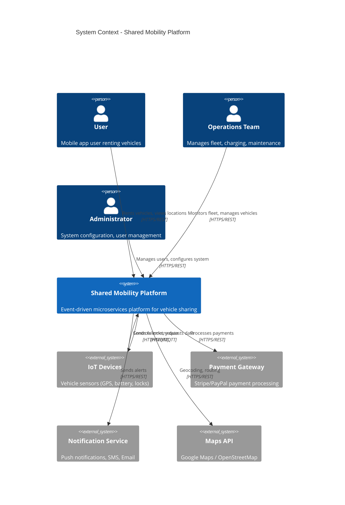
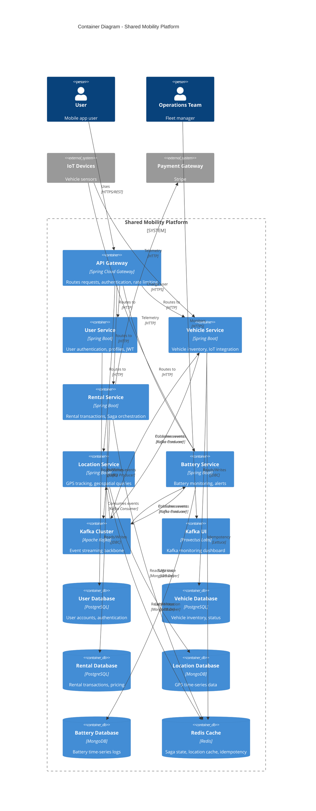
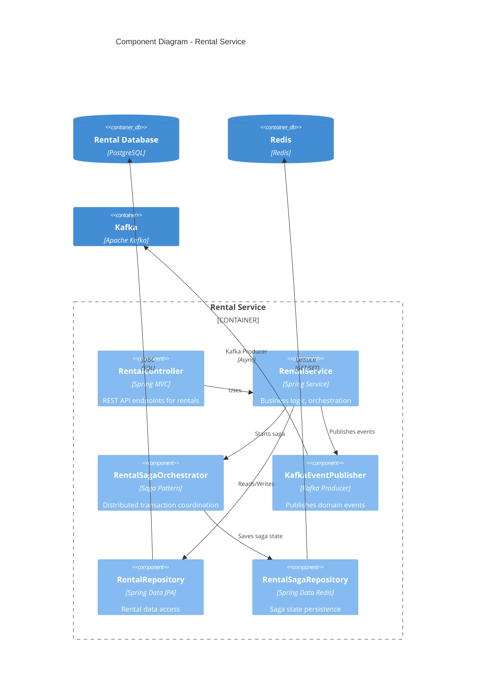
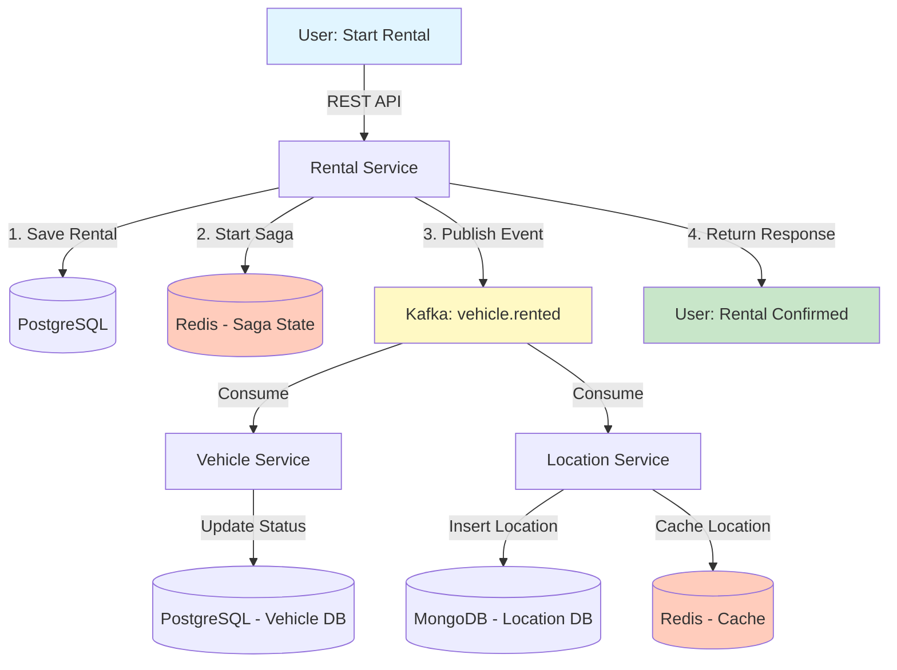
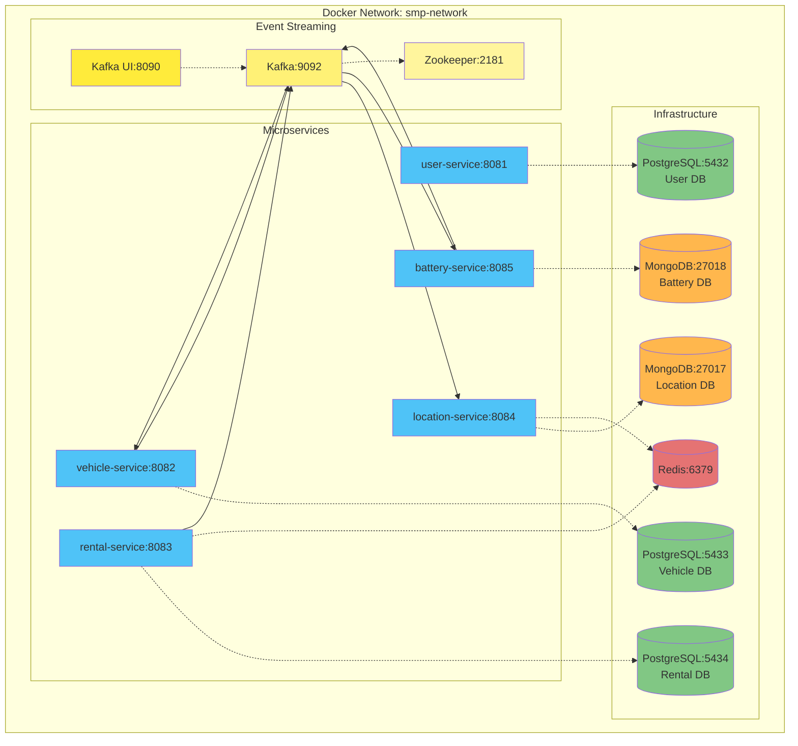
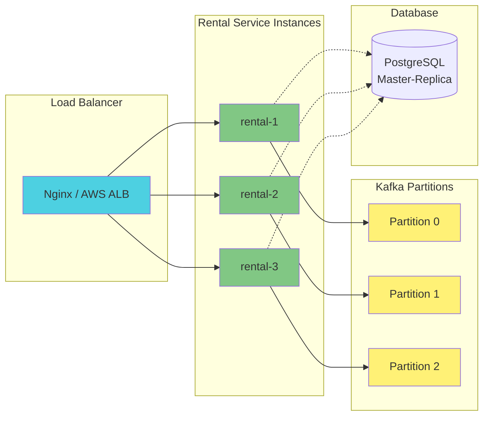
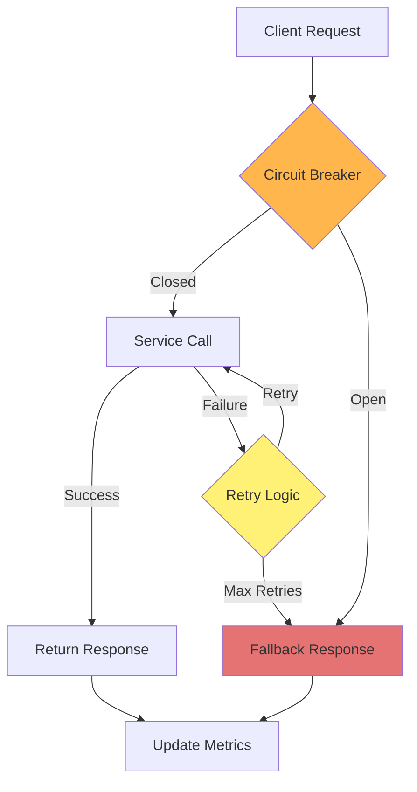
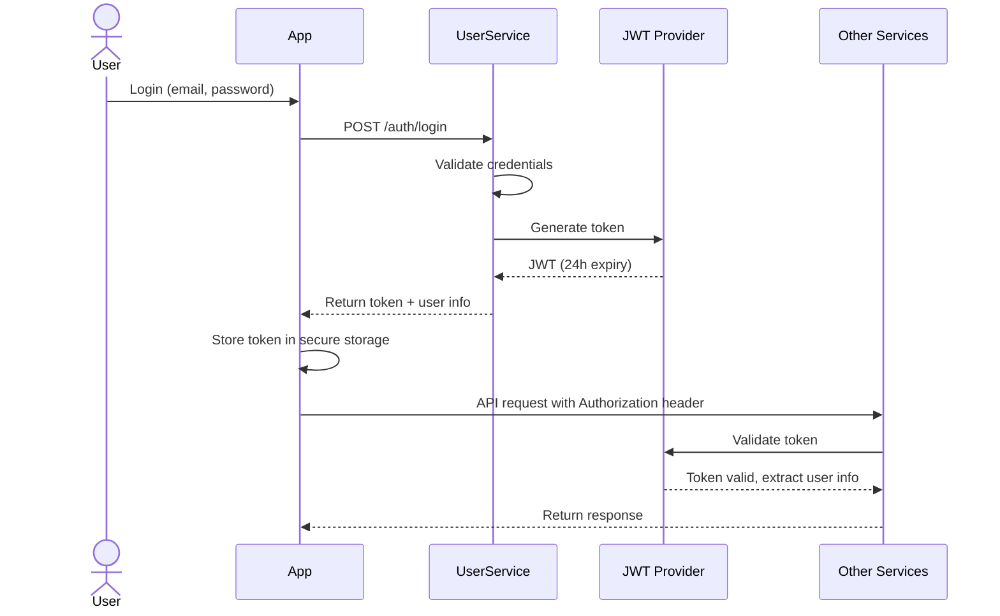
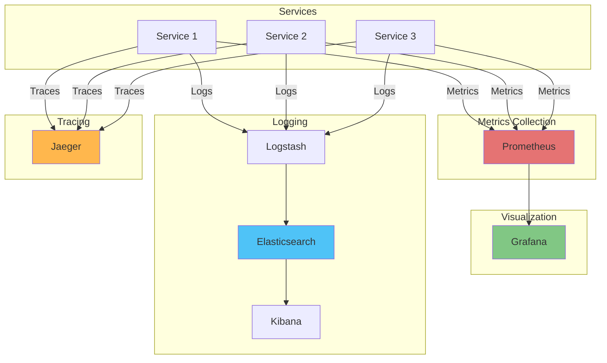

# Architecture Overview: Shared Mobility Platform

This document provides a comprehensive overview of the system architecture using C4 model diagrams.

## System Context Diagram



## Container Diagram



## Component Diagram - Rental Service (Example)



## Technology Stack

### Frontend (Not Shown)
- **Mobile App**: React Native / Flutter
- **Web Dashboard**: React / Vue.js
- **Real-time Updates**: WebSocket / Server-Sent Events

### Backend Microservices
- **Framework**: Spring Boot 3.x
- **Language**: Java 17
- **API**: REST (Spring MVC)
- **Security**: Spring Security + JWT
- **Validation**: Hibernate Validator

### Databases
| Service | Database | Type | Purpose |
|---------|----------|------|---------|
| User Service | PostgreSQL | Relational | User accounts, authentication |
| Vehicle Service | PostgreSQL | Relational | Vehicle inventory, status |
| Rental Service | PostgreSQL | Relational | Rental transactions, pricing |
| Location Service | MongoDB | Document (Time-series) | GPS tracking data |
| Battery Service | MongoDB | Document (Time-series) | Battery telemetry logs |
| All Services | Redis | In-Memory Cache | Saga state, location cache, idempotency |

### Messaging & Event Streaming
- **Event Bus**: Apache Kafka 3.x
- **Event Format**: JSON (Jackson serialization)
- **Consumer Groups**: Shared-mobility-group
- **Topics**: 14 topics (vehicle.*, battery.*, location.*, rental.*, payment.*)
- **Monitoring**: Kafka UI (Provectus Labs)

### Infrastructure
- **Containerization**: Docker + Docker Compose
- **Orchestration** (Future): Kubernetes
- **Service Discovery** (Future): Eureka / Consul
- **API Gateway** (Future): Spring Cloud Gateway / Kong
- **Monitoring**: Prometheus + Grafana (not implemented)
- **Logging**: ELK Stack (not implemented)

## Communication Patterns

### Synchronous Communication (REST)
```
Client → API Gateway → Microservice → Database
                     ↓
                 Response (200 OK)
```

**Use Cases:**
- User login/registration
- Query vehicle availability
- Get rental history
- Fetch real-time location

**Characteristics:**
- Request-Response pattern
- Immediate consistency
- Blocking (waits for response)
- Timeout handling required

### Asynchronous Communication (Kafka Events)
```
Service A → Kafka Topic → Service B
                       → Service C (parallel)
                       → Service D (parallel)
```

**Use Cases:**
- Vehicle rented → Update vehicle status, start location tracking
- Vehicle returned → Update vehicle, record end location, check battery
- Battery low → Notify ops team, update vehicle status

**Characteristics:**
- Fire-and-Forget pattern
- Eventual consistency
- Non-blocking (async processing)
- Fault tolerance (message persistence)

## Data Flow - Vehicle Rental Example



## Deployment Architecture (Docker Compose)



## Network Ports

| Service | Internal Port | External Port | Protocol |
|---------|--------------|---------------|----------|
| User Service | 8081 | 8081 | HTTP |
| Vehicle Service | 8082 | 8082 | HTTP |
| Rental Service | 8083 | 8083 | HTTP |
| Location Service | 8084 | 8084 | HTTP |
| Battery Service | 8085 | 8085 | HTTP |
| PostgreSQL (User) | 5432 | 5432 | PostgreSQL |
| PostgreSQL (Vehicle) | 5432 | 5433 | PostgreSQL |
| PostgreSQL (Rental) | 5432 | 5434 | PostgreSQL |
| MongoDB (Location) | 27017 | 27017 | MongoDB |
| MongoDB (Battery) | 27017 | 27018 | MongoDB |
| Redis | 6379 | 6379 | Redis |
| Zookeeper | 2181 | 2181 | Zookeeper |
| Kafka | 9092 | 9092 | Kafka |
| Kafka UI | 8080 | 8090 | HTTP |

## Scalability Architecture

### Horizontal Scaling Strategy



### Scaling Characteristics

| Component | Scaling Strategy | Max Instances | Bottleneck |
|-----------|-----------------|---------------|------------|
| User Service | Horizontal | 10+ | PostgreSQL write throughput |
| Vehicle Service | Horizontal | 10+ | PostgreSQL write throughput |
| Rental Service | Horizontal | 10+ | Redis connections, Kafka producer |
| Location Service | Horizontal | 20+ | MongoDB write throughput |
| Battery Service | Horizontal | 20+ | MongoDB write throughput |
| PostgreSQL | Master-Replica | 1 master + N replicas | Master write IOPS |
| MongoDB | Sharding | Unlimited | Network bandwidth |
| Redis | Cluster | 3-6 nodes | Memory |
| Kafka | Partitioning | 10+ brokers | Disk I/O |

## High Availability & Fault Tolerance

### Service Resilience Patterns



### Implemented Resilience Mechanisms

1. **Idempotency** (✅ Implemented)
   - Redis-backed idempotency checker
   - Prevents duplicate event processing
   - 7-day TTL for processed event IDs

2. **Saga Pattern** (✅ Implemented)
   - Compensating transactions for failures
   - Distributed transaction coordination
   - State persistence in Redis (24h TTL)

3. **Event Replay** (✅ Via Kafka)
   - Kafka retains messages (168 hours = 7 days)
   - Can replay events from any offset
   - Useful for disaster recovery

4. **Database Replication** (⏳ Future)
   - PostgreSQL master-replica setup
   - MongoDB replica set (3 nodes)
   - Read-write split for scalability

5. **Circuit Breaker** (⏳ Future)
   - Resilience4j integration
   - Fallback for external service calls
   - Automatic recovery

6. **Health Checks** (⏳ Future)
   - Spring Boot Actuator
   - Kubernetes liveness/readiness probes
   - Dependency health monitoring

## Security Architecture

### Authentication Flow



### Security Layers

| Layer | Mechanism | Implementation |
|-------|-----------|----------------|
| **Transport** | HTTPS/TLS | SSL certificates (production) |
| **Authentication** | JWT | Spring Security + JWT |
| **Authorization** | Role-based (RBAC) | UserRole enum (CUSTOMER, OPERATOR, ADMIN) |
| **API Security** | Rate limiting | API Gateway (future) |
| **Database** | Connection pooling, encrypted passwords | HikariCP, BCrypt |
| **Event Bus** | SASL/SSL | Kafka ACLs (future) |
| **Secrets** | Environment variables | Docker secrets, AWS Secrets Manager (future) |

## Monitoring & Observability (Future)

### Planned Observability Stack



### Key Metrics to Monitor

**Service Metrics:**
- Request rate (req/s)
- Response time (p50, p95, p99)
- Error rate (%)
- JVM metrics (heap, GC)

**Business Metrics:**
- Active rentals count
- Revenue per hour
- Average trip duration
- Vehicle utilization rate

**Infrastructure Metrics:**
- Database connections
- Kafka consumer lag
- Redis memory usage
- MongoDB write throughput

## Related Files

### Infrastructure Configuration
- `/docker-compose.yml` - Full stack deployment
- `/services/*/src/main/resources/application.yml` - Service configurations

### Network Configuration
- Kafka: `kafka:9092` (internal), `localhost:29092` (host)
- All services on `smp-network` Docker bridge network

## Architecture Decision Records (ADRs)

See `docs/architecture-decisions.md` for detailed rationale on:
- Why microservices over monolith
- Why Kafka over RabbitMQ
- Why MongoDB for time-series data
- Why Saga over 2PC
- Why Redis for caching and saga state
