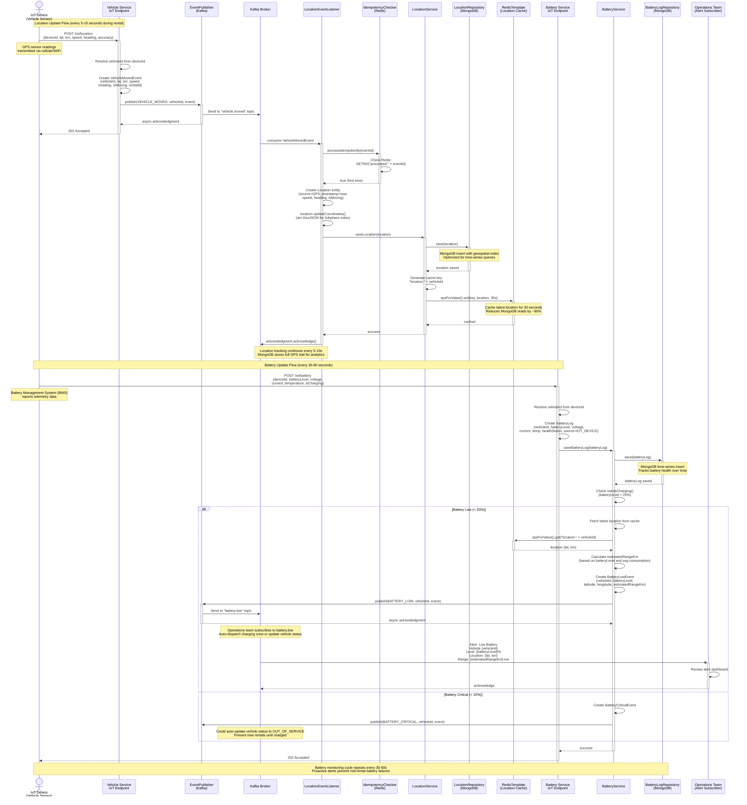

# Sequence Diagram: Real-time Location & Battery Monitoring

This diagram illustrates the real-time monitoring flows for vehicle telemetry data:
- GPS location updates from IoT devices
- Battery level monitoring and low-battery alerts
- Redis caching for high-frequency data access
- Event-driven architecture for monitoring alerts

## Diagram



## Key Components

### Location Update Flow
1. **IoT Device**: Sends GPS coordinates via cellular/WiFi (every 5-10 seconds during rental)
2. **Vehicle Service IoT Endpoint**: Receives telemetry, publishes VehicleMovedEvent
3. **LocationEventListener**: Consumes event, creates Location record
4. **LocationRepository (MongoDB)**: Stores geospatial time-series data
5. **RedisTemplate**: Caches latest location (30-second TTL)

### Battery Update Flow
6. **IoT Device BMS**: Reports battery telemetry (every 30-60 seconds)
7. **Battery Service IoT Endpoint**: Receives data, creates BatteryLog
8. **BatteryService**: Checks battery level thresholds
9. **EventPublisher**: Publishes BatteryLowEvent if level < 20%
10. **Operations Team**: Subscribes to alerts, dispatches charging crews

## Data Models

### VehicleMovedEvent
```java
{
  "eventId": "uuid",
  "eventType": "VehicleMoved",
  "timestamp": "2025-01-24T14:32:15",
  "vehicleId": "uuid",
  "latitude": 37.7749,
  "longitude": -122.4194,
  "speed": 15.5,  // km/h
  "heading": 270,  // degrees (0-360)
  "isMoving": true,
  "rentalId": "uuid"  // null if not rented
}
```

### Location (MongoDB Document)
```java
{
  "_id": "uuid",
  "vehicleId": "uuid",  // indexed
  "timestamp": ISODate("2025-01-24T14:32:15"),  // indexed
  "latitude": 37.7749,
  "longitude": -122.4194,
  "coordinates": [-122.4194, 37.7749],  // GeoJSON [lon, lat]
  "altitude": 10.5,  // meters
  "speed": 15.5,  // km/h
  "heading": 270,  // degrees
  "accuracy": 5.0,  // meters
  "source": "GPS",  // GPS | NETWORK | CELLULAR
  "isMoving": true,
  "rentalId": "uuid"
}
```

### BatteryLog (MongoDB Document)
```java
{
  "_id": "uuid",
  "vehicleId": "uuid",  // indexed
  "timestamp": ISODate("2025-01-24T14:32:15"),  // indexed
  "batteryLevel": 18,  // 0-100%
  "voltage": 48.2,  // volts
  "current": -5.3,  // amps (negative = discharging)
  "temperature": 35.5,  // celsius
  "cycleCount": 245,  // charge cycles
  "healthStatus": "FAIR",  // GOOD | FAIR | POOR | CRITICAL
  "isCharging": false,
  "estimatedRangeKm": 8,  // calculated
  "estimatedTimeToFullCharge": null,  // minutes (if charging)
  "chargingStationId": null,
  "source": "IOT_DEVICE"
}
```

### BatteryLowEvent
```java
{
  "eventId": "uuid",
  "eventType": "BatteryLow",
  "timestamp": "2025-01-24T14:32:15",
  "vehicleId": "uuid",
  "batteryLevel": 18,  // %
  "latitude": 37.7749,
  "longitude": -122.4194,
  "estimatedRangeKm": 8
}
```

## Database Operations

| Service | Database | Operation | Collection/Table | Index |
|---------|----------|-----------|------------------|-------|
| Location Service | MongoDB | INSERT | location_logs | vehicleId (asc), timestamp (desc) |
| Location Service | MongoDB | GEOSPATIAL QUERY | location_logs | coordinates (2dsphere) |
| Location Service | Redis | SET (30s TTL) | N/A | key: "location:{vehicleId}" |
| Battery Service | MongoDB | INSERT | battery_logs | vehicleId (asc), timestamp (desc), batteryLevel (asc) |

## Caching Strategy

### Location Cache (Redis)
```javascript
Key Pattern: "location:{vehicleId}"
Value: Location JSON object
TTL: 30 seconds
Purpose: Serve real-time location requests without MongoDB queries

Cache Hit Scenario:
  User opens app → Requests nearby vehicles
  → LocationService checks Redis cache (sub-millisecond)
  → If hit, return cached location
  → If miss, query MongoDB + cache result

Cache Invalidation:
  - TTL-based (30s) - automatic expiration
  - New location update overwrites previous cache entry
```

### Performance Impact
- **Without Cache**: 500 req/s → MongoDB overload (30ms latency)
- **With Cache (95% hit rate)**: 500 req/s → 475 from Redis (1ms), 25 from MongoDB (30ms)
- **Average Latency**: (0.95 × 1ms) + (0.05 × 30ms) = 2.45ms

## Geospatial Queries

### MongoDB 2dsphere Index
```javascript
db.location_logs.createIndex({ coordinates: "2dsphere" })

// Find vehicles within 1 km radius
db.location_logs.find({
  coordinates: {
    $near: {
      $geometry: { type: "Point", coordinates: [-122.4194, 37.7749] },
      $maxDistance: 1000  // meters
    }
  }
})

// Find vehicles in bounding box (e.g., map viewport)
db.location_logs.find({
  coordinates: {
    $geoWithin: {
      $box: [
        [-122.5, 37.7],  // southwest corner
        [-122.3, 37.8]   // northeast corner
      ]
    }
  }
})
```

## Battery Alert Thresholds

### Alert Levels
| Battery Level | Alert | Action | Event Published |
|--------------|-------|--------|-----------------|
| 100-20% | None | Normal operation | None |
| 20-10% | Warning | Notify ops team, suggest charging | `battery.low` |
| 10-5% | Critical | Update status to CHARGING, dispatch crew | `battery.critical` |
| < 5% | Emergency | Mark OUT_OF_SERVICE, prevent new rentals | `battery.emergency` |

### Estimated Range Calculation
```java
public Long calculateEstimatedRange(Integer batteryLevel) {
    // Average consumption: 1% battery = 0.8 km range
    // Example: 18% battery → 18 × 0.8 = 14.4 km
    double avgKmPerPercent = 0.8;
    return Math.round(batteryLevel * avgKmPerPercent);
}
```

### Health Status Determination
```java
public String determineHealthStatus(Integer cycleCount, Double temperature) {
    if (cycleCount > 1000 || temperature > 60) return "CRITICAL";
    if (cycleCount > 500 || temperature > 50) return "POOR";
    if (cycleCount > 250 || temperature > 40) return "FAIR";
    return "GOOD";
}
```

## IoT Device Communication

### Protocols Supported
1. **HTTP REST API** (current implementation)
   - POST requests from device to cloud
   - Simple, widely supported
   - Higher latency, higher power consumption

2. **MQTT** (future enhancement)
   - Publish/Subscribe model
   - Lower latency, lower power
   - Better for battery-powered devices

3. **CoAP** (Constrained Application Protocol)
   - Designed for IoT devices
   - UDP-based (vs HTTP's TCP)
   - Minimal overhead

### Device Payload Example (HTTP)
```json
POST /iot/telemetry
{
  "deviceId": "IOT-12345",
  "timestamp": "2025-01-24T14:32:15Z",
  "location": {
    "lat": 37.7749,
    "lon": -122.4194,
    "speed": 15.5,
    "heading": 270,
    "accuracy": 5.0
  },
  "battery": {
    "level": 18,
    "voltage": 48.2,
    "current": -5.3,
    "temperature": 35.5,
    "isCharging": false
  },
  "status": "IN_USE"
}
```

## Monitoring Dashboard Use Cases

### Operations Team Dashboard
**Real-time Metrics:**
- Total active rentals (count)
- Average battery level across fleet (%)
- Number of vehicles needing charge (battery < 20%)
- Vehicles offline (no telemetry > 5 minutes)

**Map View:**
- All vehicles with color-coded battery levels
  - Green: > 50%
  - Yellow: 20-50%
  - Red: < 20%
- Click vehicle → See last 1-hour GPS trail
- Heatmap of high-demand areas

**Alerts:**
- Low battery vehicles with location
- Vehicles not moving for > 24 hours (potential theft/malfunction)
- Temperature anomalies (overheating battery)

### User App
**Nearby Vehicles Map:**
- Query: Find vehicles within 1 km radius
- Display: Battery level, distance, vehicle type
- Real-time updates via WebSocket (location changes)

**Active Rental Tracking:**
- Show current speed, battery level
- Estimated remaining range
- Trip distance and duration (live)

## Error Scenarios

### Scenario 1: IoT Device Offline
```
Device loses cellular connection
→ No telemetry for > 5 minutes
→ LocationService detects missing updates (via scheduled job)
→ Update vehicle status to OFFLINE
→ Alert ops team via Kafka event
→ Remove vehicle from "available" list in user app
```

### Scenario 2: GPS Accuracy Poor
```
Device reports accuracy > 50 meters (e.g., indoors, urban canyon)
→ LocationService marks location.accuracy = 50
→ Don't use for billing distance calculation (too inaccurate)
→ Use last accurate location or fallback to start/end locations
```

### Scenario 3: Battery Sensor Malfunction
```
BatteryLog shows impossible reading (e.g., 120%, -10%)
→ BatteryService validates batteryLevel (must be 0-100)
→ If invalid, log error, skip processing
→ Alert maintenance team (sensor needs calibration)
```

### Scenario 4: Kafka Event Delivery Failure
```
VehicleMovedEvent publish fails (broker down)
→ EventPublisher retries (Kafka producer retry policy: 3 retries, 1s backoff)
→ If all retries fail, log error
→ Telemetry data lost for this update (acceptable for location, re-sent in 5-10s)
→ For critical events (battery low), implement outbox pattern for guaranteed delivery
```

## Performance Considerations

### Location Update Frequency
- **During Rental**: Every 5-10 seconds
- **Idle (Available)**: Every 60 seconds (battery conservation)
- **Charging**: Every 5 minutes
- **Offline**: No updates

### MongoDB Write Throughput
```
1000 vehicles × 10 updates/min = 10,000 writes/min = 166 writes/sec
MongoDB easily handles this (can scale to 100K+ writes/sec with sharding)
```

### Redis Cache Memory Usage
```
1000 vehicles × 500 bytes per Location JSON = 500 KB
With 30s TTL, negligible memory footprint
```

### Network Bandwidth (IoT Devices)
```
Location payload: ~200 bytes
Battery payload: ~150 bytes
Combined: ~350 bytes per update

Per vehicle per hour:
  (350 bytes × 6 updates/min) × 60 min = 126 KB/hour

Fleet of 1000 vehicles:
  126 KB × 1000 = 126 MB/hour = ~3 GB/day
```

## Critical Design Decisions

### 1. MongoDB for Time-Series Data
- **Decision**: Use MongoDB (not PostgreSQL) for Location and BatteryLog
- **Reason**:
  - Native geospatial indexing (2dsphere)
  - High write throughput for append-only data
  - Efficient time-range queries
- **Alternative**: TimescaleDB (PostgreSQL extension for time-series)

### 2. Redis Caching for Latest Location
- **Decision**: Cache latest location in Redis (30s TTL)
- **Reason**: 95% of queries are for "current location", not historical trail
- **Benefit**: Sub-millisecond latency, offloads MongoDB
- **Trade-off**: Slightly stale data (up to 30s old), acceptable for this use case

### 3. Event-Driven Telemetry Processing
- **Decision**: IoT endpoint publishes to Kafka (not synchronous DB writes)
- **Reason**: Decouples ingestion from processing, enables multiple consumers
- **Benefit**: Can add analytics consumer, anomaly detection, etc.
- **Trade-off**: Eventual consistency (telemetry not immediately queryable)

### 4. Battery Alert Thresholds
- **Decision**: 20% = low, 10% = critical
- **Reason**: Based on typical e-scooter range (20% = ~15 km, enough for most trips)
- **Configurable**: Thresholds stored in application.yml, can adjust per vehicle type

## Related Files

### Domain Models
- `/common/common-domain/src/main/java/com/next/common/domain/model/Location.java`
- `/common/common-domain/src/main/java/com/next/common/domain/model/BatteryLog.java`
- `/common/common-event/src/main/java/com/next/common/event/model/VehicleMovedEvent.java`
- `/common/common-event/src/main/java/com/next/common/event/model/BatteryLowEvent.java`

### Services
- `/services/location-service/src/main/java/com/next/locationservice/service/LocationService.java:40` (saveLocation with Redis cache)
- `/services/battery-service/src/main/java/com/next/batteryservice/service/BatteryService.java:48` (checkBatteryLevel)

### Event Handling
- `/services/location-service/src/main/java/com/next/locationservice/consumer/LocationEventListener.java:68` (handleVehicleMoved)

### Configuration
- `/services/location-service/src/main/resources/application.yml` (Redis cache TTL)
- `/services/battery-service/src/main/resources/application.yml` (Alert thresholds)

## Future Enhancements

### 1. Predictive Battery Management
- Machine learning model to predict battery drain based on:
  - Historical usage patterns
  - Terrain (hills drain faster)
  - Weather (cold reduces battery efficiency)
  - Rider weight estimation

### 2. Geofencing
- Define service areas (polygon boundaries)
- Alert if vehicle moved outside service area
- Auto-pause rental if leaving zone
- Pricing surcharge for outside-zone returns

### 3. Route Optimization
- Track popular routes (start → end location clusters)
- Suggest optimal redistribution to ops team
- Predict high-demand areas (events, commute times)

### 4. Anomaly Detection
- Detect unusual speed (potential accident)
- Identify stationary vehicles in rentals (mechanical failure)
- Battery temperature spikes (fire risk)
- Abnormal movement patterns (theft)
