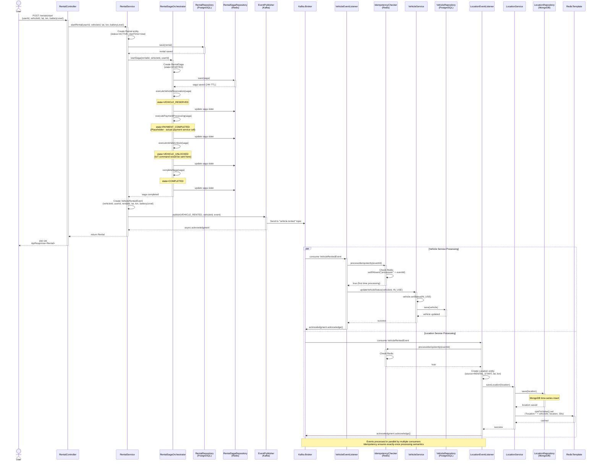

# Sequence Diagram: Vehicle Rental Flow

This diagram illustrates the complete flow of a vehicle rental operation, including:
- User authentication and rental request
- Saga orchestration for distributed transaction management
- Kafka event publishing and asynchronous consumption
- Database operations across multiple microservices

## Diagram



## Key Components

### Synchronous Flow (REST API)
1. **Client → RentalController**: HTTP POST request with rental details
2. **RentalService**: Orchestrates rental creation and saga start
3. **RentalSagaOrchestrator**: Executes distributed transaction steps
4. **RentalRepository**: Persists rental to PostgreSQL
5. **RentalSagaRepository**: Stores saga state in Redis (24h TTL)
6. **EventPublisher**: Publishes VehicleRentedEvent to Kafka

### Asynchronous Flow (Event-Driven)
7. **Kafka**: Delivers event to all subscribed consumers
8. **VehicleEventListener**: Updates vehicle status to IN_USE
9. **LocationEventListener**: Creates rental start location record
10. **IdempotencyChecker**: Prevents duplicate event processing using Redis

## Saga Pattern Implementation

### Saga Steps (Sequential Execution)
1. **VEHICLE_RESERVATION**: Reserve vehicle for the rental
2. **PAYMENT_PROCESSING**: Process payment authorization
3. **VEHICLE_UNLOCK**: Send unlock command to IoT device
4. **COMPLETED**: Mark saga as successfully completed

### Compensation Logic (Not Shown)
If any step fails, the orchestrator executes compensating actions in reverse order:
- Unlock fails → Refund payment → Release vehicle reservation

## Database Operations

| Service | Database | Operation | Entity |
|---------|----------|-----------|--------|
| Rental Service | PostgreSQL | INSERT | Rental (transactional data) |
| Rental Service | Redis | SET (24h TTL) | RentalSaga (orchestration state) |
| Vehicle Service | PostgreSQL | UPDATE | Vehicle (status change) |
| Location Service | MongoDB | INSERT | Location (time-series) |
| Location Service | Redis | SET (30s TTL) | Location (cache) |
| Idempotency Checker | Redis | SETNX (7d TTL) | Event ID (processed marker) |

## Event Flow

```
RentalService
    ↓ (publish)
Kafka Topic: vehicle.rented
    ↓ (consume, parallel)
┌─────────────────┬─────────────────────┐
VehicleEventListener  LocationEventListener
    ↓                      ↓
VehicleService       LocationService
    ↓                      ↓
UPDATE Vehicle       INSERT Location
status=IN_USE        + Cache in Redis
```

## Critical Design Decisions

### 1. Saga Pattern over Two-Phase Commit (2PC)
- **Reason**: Microservices architecture doesn't support distributed transactions
- **Benefit**: Each service maintains its own database, eventual consistency
- **Trade-off**: Complexity of compensation logic vs. immediate consistency

### 2. Event-Driven Architecture
- **Reason**: Loose coupling between Rental, Vehicle, and Location services
- **Benefit**: Failure isolation (if Location Service is down, rental still succeeds)
- **Implementation**: Kafka with at-least-once delivery + idempotency

### 3. Idempotency via Redis
- **Reason**: Kafka guarantees at-least-once delivery, which can cause duplicates
- **Implementation**: `SETNX` operation provides atomic check-and-set
- **TTL**: 7 days (balances memory usage vs. replay window)

### 4. Redis for Saga State
- **Reason**: Fast access, automatic cleanup with TTL
- **TTL**: 24 hours (sagas should complete within minutes, 24h is safety margin)
- **Alternative**: Could use PostgreSQL, but Redis provides better performance

## Error Scenarios

### Scenario 1: Payment Processing Fails
1. Saga reaches PAYMENT_COMPLETED step
2. Payment service returns error
3. Orchestrator calls `compensateSaga(saga, "Payment declined")`
4. Compensation steps execute in reverse:
   - Release vehicle reservation
   - Update rental status to FAILED
5. Return error to client

### Scenario 2: Kafka Event Publishing Fails
1. Rental is created and saga completes
2. Event publishing to Kafka fails (broker down)
3. EventPublisher retries (Kafka producer retry policy)
4. If all retries fail, rental exists but event not published
5. **Mitigation**: Outbox pattern (not implemented) or manual retry mechanism

### Scenario 3: Duplicate Event Consumption
1. Kafka redelivers VehicleRentedEvent (network issue)
2. VehicleEventListener receives duplicate
3. IdempotencyChecker detects event already processed (Redis key exists)
4. Listener skips processing and acknowledges
5. **Result**: Vehicle status only updated once

## Performance Considerations

### Synchronous Latency
- Rental creation: ~50-100ms (DB write)
- Saga orchestration: ~100-200ms (3 steps + Redis writes)
- Event publishing: ~10-20ms (async, doesn't block response)
- **Total API response time**: ~150-300ms

### Asynchronous Processing
- Event delivery latency: ~50-100ms (Kafka)
- Vehicle status update: ~50ms (DB write)
- Location record creation: ~30ms (MongoDB + Redis cache)
- **Total event processing time**: ~100-200ms after API response

### Scalability
- Kafka partitions enable parallel processing by vehicle ID
- Each microservice can scale independently
- Redis caching reduces MongoDB read load by ~95%

## Related Files

### Domain Models
- `/common/common-domain/src/main/java/com/next/common/domain/model/Rental.java`
- `/common/common-event/src/main/java/com/next/common/event/model/VehicleRentedEvent.java`

### Services
- `/services/rental-service/src/main/java/com/next/rentalservice/service/RentalService.java:45`
- `/services/rental-service/src/main/java/com/next/rentalservice/saga/RentalSagaOrchestrator.java:30`

### Event Handling
- `/services/vehicle-service/src/main/java/com/next/vehicleservice/consumer/VehicleEventListener.java:28`
- `/services/location-service/src/main/java/com/next/locationservice/consumer/LocationEventListener.java:35`
- `/common/common-event/src/main/java/com/next/common/event/consumer/IdempotencyChecker.java:22`
