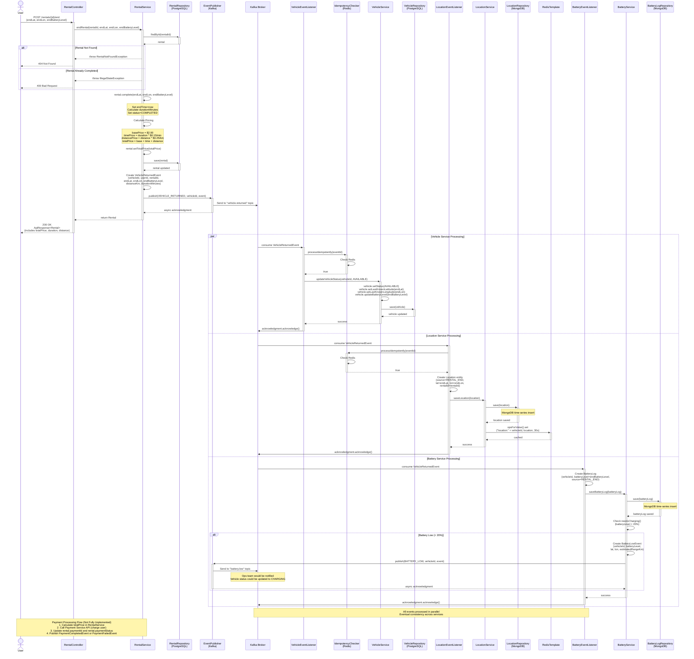

# Sequence Diagram: Vehicle Return & Payment Flow

This diagram illustrates the complete flow of a vehicle return operation, including:
- Rental completion and duration/distance calculation
- Payment processing (fee calculation)
- Event publishing for vehicle status and location updates
- Asynchronous event consumption by multiple services

## Diagram



## Key Components

### Synchronous Flow (REST API)
1. **Client → RentalController**: HTTP POST to end rental with location and battery data
2. **RentalService**: Retrieves rental, calculates fees, completes rental
3. **Rental.complete()**: Sets end time, calculates duration, updates status
4. **Pricing Calculation**: Base + time-based + distance-based fees
5. **RentalRepository**: Updates rental in PostgreSQL with final pricing
6. **EventPublisher**: Publishes VehicleReturnedEvent to Kafka

### Asynchronous Flow (Event-Driven)
7. **Kafka**: Delivers event to three consumers in parallel
8. **VehicleEventListener**: Updates vehicle status to AVAILABLE, updates location and battery
9. **LocationEventListener**: Creates rental end location record in MongoDB
10. **BatteryEventListener**: Logs final battery level, checks if charging needed

## Pricing Calculation

### Formula
```javascript
basePrice = $2.00 (flat fee per rental)
timePrice = durationMinutes × $0.15/min
distancePrice = distanceKm × $0.25/km
totalPrice = basePrice + timePrice + distancePrice
```

### Example Calculation
```
Rental Duration: 45 minutes
Distance Traveled: 8.5 km

basePrice = $2.00
timePrice = 45 × $0.15 = $6.75
distancePrice = 8.5 × $0.25 = $2.125

totalPrice = $2.00 + $6.75 + $2.125 = $10.875 ≈ $10.88
```

## Database Operations

| Service | Database | Operation | Entity | Purpose |
|---------|----------|-----------|--------|---------|
| Rental Service | PostgreSQL | UPDATE | Rental | Complete rental with pricing |
| Vehicle Service | PostgreSQL | UPDATE | Vehicle | Set status=AVAILABLE, update location & battery |
| Location Service | MongoDB | INSERT | Location | Record rental end position |
| Location Service | Redis | SET (30s TTL) | Location | Cache latest location |
| Battery Service | MongoDB | INSERT | BatteryLog | Log final battery level |
| Idempotency Checker | Redis | SETNX (7d TTL) | Event ID | Prevent duplicate processing |

## Event Flow

```
RentalService (endRental)
    ↓ (publish)
Kafka Topic: vehicle.returned
    ↓ (consume, parallel)
┌──────────────────┬────────────────────┬───────────────────┐
VehicleEventListener  LocationEventListener  BatteryEventListener
    ↓                     ↓                      ↓
UPDATE Vehicle       INSERT Location        INSERT BatteryLog
status=AVAILABLE     + Cache                + Check if low
location, battery                            ↓ (if < 20%)
                                         Publish BATTERY_LOW
```

## Battery Alert Logic

### Conditions for BatteryLowEvent
```java
if (batteryLevel < 20%) {
    // Publish BatteryLowEvent
    // Ops team notified
    // Vehicle may be marked for charging
}

if (batteryLevel < 10%) {
    // Could publish BatteryCriticalEvent
    // Auto-update vehicle status to OUT_OF_SERVICE
}
```

### Battery Status Mapping
| Battery Level | Action | Event Published |
|--------------|--------|-----------------|
| > 20% | Normal operation | None |
| 10-20% | Warning | `battery.low` |
| < 10% | Critical | `battery.critical` |

## Payment Processing Flow (Placeholder)

### Current Implementation
- Pricing calculated in RentalService
- `rental.totalPrice` stored in database
- Payment integration is **placeholder logic**

### Expected Integration
```javascript
1. Calculate totalPrice in RentalService
2. Call Payment Service REST API:
   POST /payments/charge
   {
     "userId": "...",
     "rentalId": "...",
     "amount": 10.88,
     "currency": "USD"
   }
3. Payment Service responses:
   - Success: paymentId, status=COMPLETED
   - Failure: errorCode, status=FAILED
4. Update rental:
   rental.setPaymentId(paymentId)
   rental.setPaymentStatus(status)
5. Publish PaymentCompletedEvent or PaymentFailedEvent
6. If payment fails, could trigger refund flow or retry
```

## Error Scenarios

### Scenario 1: Rental Not Found
```
User returns non-existent rental ID
→ RentalRepository.findById() returns empty
→ RentalService throws RentalNotFoundException
→ Controller returns 404 Not Found
```

### Scenario 2: Rental Already Completed
```
User tries to end already-completed rental
→ RentalService checks rental.status
→ If status == COMPLETED, throw IllegalStateException
→ Controller returns 400 Bad Request
```

### Scenario 3: Event Processing Failure
```
LocationEventListener fails (MongoDB down)
→ Kafka does not receive acknowledgment
→ Event redelivered after consumer timeout
→ Retry until success or max retries reached
→ Dead Letter Queue (DLQ) if all retries fail
```

### Scenario 4: Payment Service Unavailable
```
Payment API call fails (timeout, 500 error)
→ RentalService catches exception
→ Set rental.paymentStatus = PENDING
→ Implement retry mechanism or manual reconciliation
→ User notified of pending payment
```

## Critical Design Decisions

### 1. Eventual Consistency
- **Decision**: Vehicle status updated asynchronously via events
- **Reason**: Rental completion doesn't wait for vehicle update
- **Benefit**: Faster API response, resilience to downstream failures
- **Trade-off**: Brief window where rental is completed but vehicle still shows IN_USE

### 2. Parallel Event Processing
- **Decision**: Vehicle, Location, Battery services consume event independently
- **Reason**: No dependencies between these updates
- **Benefit**: Faster overall processing, independent scaling
- **Implementation**: Kafka consumer groups with multiple partitions

### 3. Pricing Calculation in Rental Service
- **Decision**: Calculate fees during rental completion (not separate service)
- **Reason**: Simpler architecture for MVP
- **Trade-off**: Harder to change pricing logic (coupled to RentalService)
- **Future**: Could extract to Pricing Service for dynamic pricing

### 4. Battery Monitoring via Events
- **Decision**: BatteryService monitors VehicleReturnedEvent for low battery
- **Alternative**: Periodic batch job to check all vehicles
- **Benefit**: Real-time alerts, event-driven architecture consistency

## Performance Considerations

### Synchronous Latency
- Rental lookup: ~10-20ms (indexed query)
- Pricing calculation: ~1ms (in-memory math)
- Rental update: ~30-50ms (DB write with indexes)
- Event publishing: ~10-20ms (async to Kafka)
- **Total API response time**: ~50-100ms

### Asynchronous Processing
- Event delivery: ~50-100ms (Kafka latency)
- Vehicle update: ~30ms (single row update)
- Location insert: ~20ms (MongoDB append-only)
- Battery log insert: ~20ms (MongoDB)
- **Total event processing**: ~100-150ms after API response

### Scalability Bottlenecks
- **PostgreSQL writes**: Rental and Vehicle tables (can add read replicas)
- **MongoDB inserts**: High throughput for Location/BatteryLog (sharding)
- **Kafka partitions**: Partition by vehicleId for parallelism
- **Redis**: Cache expiration helps manage memory

## Related Files

### Domain Models
- `/common/common-domain/src/main/java/com/next/common/domain/model/Rental.java:85` (complete method)
- `/common/common-event/src/main/java/com/next/common/event/model/VehicleReturnedEvent.java`

### Services
- `/services/rental-service/src/main/java/com/next/rentalservice/service/RentalService.java:67` (endRental method)
- `/services/vehicle-service/src/main/java/com/next/vehicleservice/service/VehicleService.java:42`
- `/services/battery-service/src/main/java/com/next/batteryservice/service/BatteryService.java:35`

### Event Handling
- `/services/vehicle-service/src/main/java/com/next/vehicleservice/consumer/VehicleEventListener.java:45` (handleVehicleReturned)
- `/services/location-service/src/main/java/com/next/locationservice/consumer/LocationEventListener.java:52`
- `/services/battery-service/src/main/java/com/next/batteryservice/consumer/BatteryEventListener.java:28`

## Future Enhancements

### 1. Payment Service Integration
- Implement REST client to Payment Gateway (Stripe, PayPal, etc.)
- Handle payment failures with retry logic
- Support multiple payment methods
- Implement refund flow for cancellations

### 2. Dynamic Pricing
- Extract pricing logic to separate Pricing Service
- Implement demand-based pricing (surge pricing)
- Support promotional codes and discounts
- A/B testing for pricing strategies

### 3. Advanced Battery Management
- Predict battery drain based on usage patterns
- Optimize vehicle redistribution based on battery levels
- Auto-schedule charging for low-battery vehicles
- Alert users if vehicle won't reach destination

### 4. Real-time Notifications
- Push notification when rental ends successfully
- SMS receipt with pricing breakdown
- Email invoice with trip details
- In-app notification for payment failures
